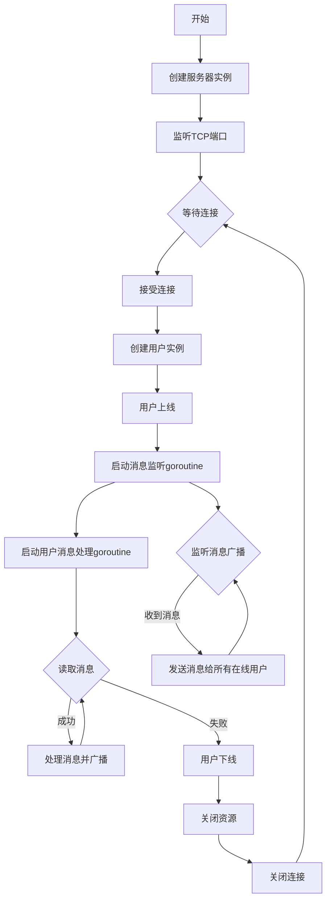

# golang_im_sys_demo

## course link
https://www.bilibili.com/video/BV1gf4y1r79E/?spm_id_from=333.337.search-card.all.click

## structure
server.go: process server-side business

user.go: process user-side business  
client.go: mock user-side client  
main.go: server starter 
